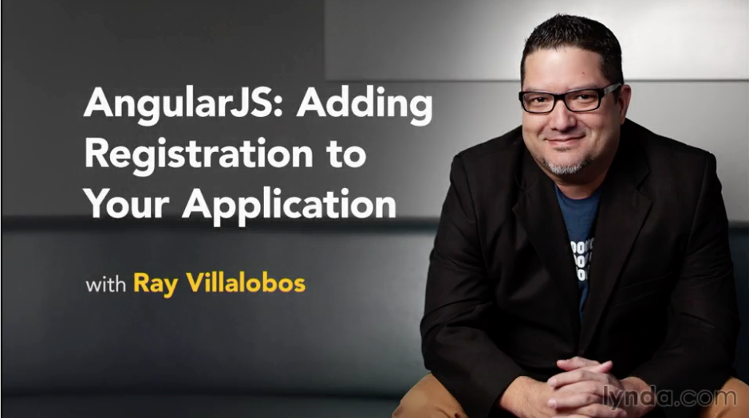

# AngularJS: Adding Registration to Your Application

This is the repository for my course, [This is the repository for my course, [AngularJS: Adding Registration to Your Application](AngularJS: Adding Registration to Your Application). The full course is available at [lynda.com](http://lynda.com).
](http://www.lynda.com/Sass-tutorials/Sass-Essential-Training/375925-2.html). The full course is available at [lynda.com](http://lynda.com).

- [My Personal Website](http://raybo.org)
- [All of my Lynda.com courses](http://lynda.com/ray)

## Course Description
Authentication is a fundamental part of any web application, but it can be notoriously difficult to implement. In this short course, you'll create a simple registration system that allows users to log in and out of your applications. By taking advantage of Google's Firebase authentication service, you can manage registrations easily and securely. In the process, you'll explore working with the AngularJS application structure (including routes and controllers), storing user information into the Firebase NoSQL database, and creating services to manage registration information throughout different controllers. This will help you create a great registration template that you can use as a starting point in a variety of web applications.

## Topics include:

- Adding a basic MVC structure
- Using routes
- Processing form input
- Integrating Firebase
- Storing registration information in the database
- Logging users in and out of an app

## Instructions
This repository has branches for each of the videos in the course. You can use the branch pop up menu in github to switch to a specific branch and take a look at the course at that stage. Or you can simply add `/tree/BRANCH_NAME` to the URL to go to the branch you want to peek at.

1. Make sure you have these installed
	- [node.js](http://nodejs.org/)
	- [git](http://git-scm.com/)
 	- [gulp](http://gulpjs.com/)
2. Clone this repository into your local machine using the terminal (mac) or Gitbash (PC) `> git clone https://github.com/planetoftheweb/angularregistration.git`
3. CD to the folder `cd angularregistration`
4. Run `> npm install` to install the project dependencies

For more help setting up a comprehensive Gulp.js workflow, check out [Web Project Workflows with Gulp.js, Git, and Browserify](http://www.lynda.com/Web-Web-Design-tutorials/Web-Project-Workflows-Gulpjs-Git-Browserify/154416-2.html).

## More Stuff
Check out some of my [other courses on lynda.com](http://lynda.com/rayvillalobos). You can also check out my [youtube channel](http://youtube.com/planetoftheweb), [follow me on twitter](http://twitter.com/planetoftheweb), or read [my blog](http://iviewsource.com).
